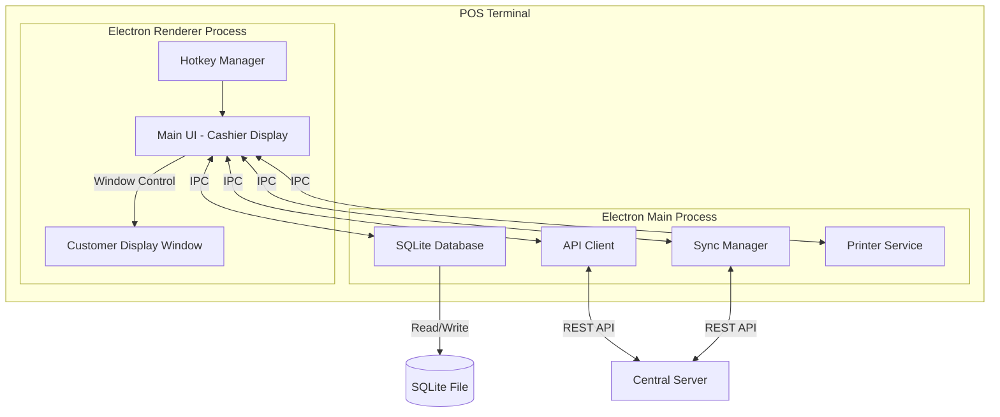
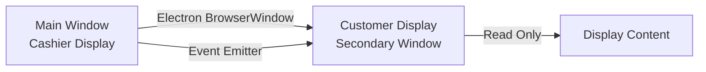
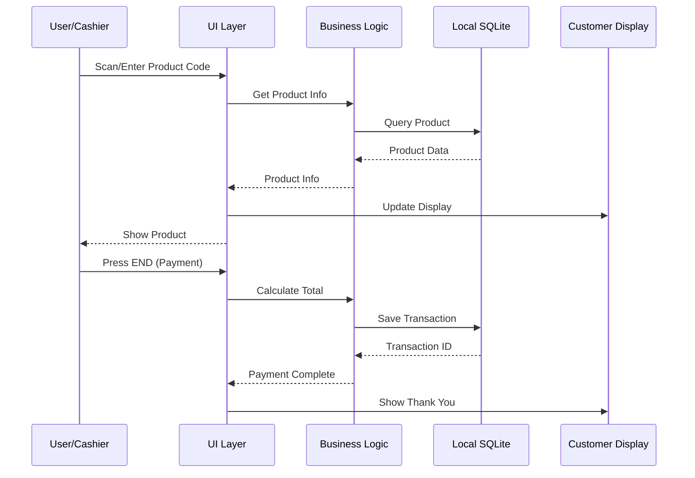
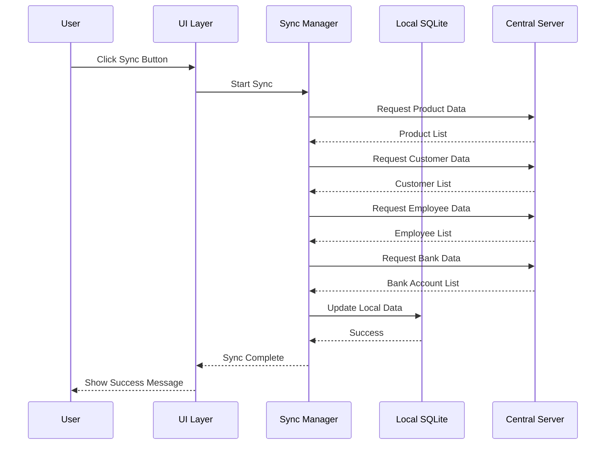
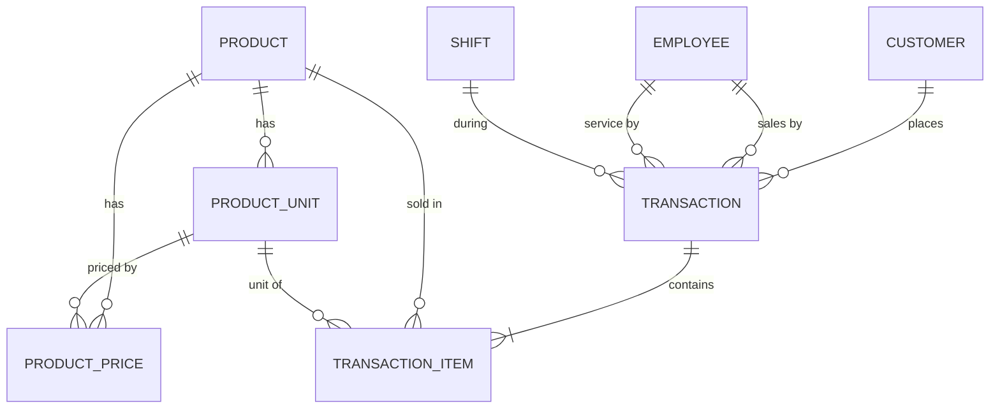

# Design Document - ระบบ POS

## Overview

ระบบ POS นี้ออกแบบเป็น Desktop Application แบบ Stand-alone ที่ทำงานบนเครื่อง POS แต่ละเครื่อง โดยใช้ฐานข้อมูล SQL ในเครื่องเพื่อความเร็วและความเสถียร พร้อมกลไกการซิงค์ข้อมูลกับ Server กลาง

### Technology Stack

**Frontend Framework:**
- **Electron** - สร้าง desktop application ที่ทำงานข้ามแพลตฟอร์ม (Windows, macOS, Linux)
- **React** - UI framework สำหรับสร้าง interface ที่ responsive
- **TypeScript** - เพิ่ม type safety และลด bugs
- **Tailwind CSS** - styling framework สำหรับ UI ที่สวยงามและรวดเร็ว

**Backend/Database:**
- **SQLite** - ฐานข้อมูลในเครื่อง เบา รวดเร็ว ไม่ต้องติดตั้ง database server
- **Sequelize ORM** - จัดการ database operations แบบ object-oriented
- **Electron IPC** - สื่อสารระหว่าง renderer process (UI) และ main process (database/business logic)

**API Communication:**
- **Axios** - HTTP client สำหรับเชื่อมต่อกับ Central Server
- **REST API** - รูปแบบการสื่อสารกับ Server กลาง

**Additional Libraries:**
- **electron-store** - จัดเก็บ configuration และ settings
- **qrcode** - สร้าง QR code สำหรับการชำระเงิน
- **electron-pos-printer** - พิมพ์ใบเสร็จ
- **hotkeys-js** - จัดการ keyboard shortcuts

### Architecture Pattern

ใช้ **Layered Architecture** แบ่งเป็น:
1. **Presentation Layer** - UI components (React)
2. **Application Layer** - Business logic และ state management
3. **Data Access Layer** - Database operations (Sequelize)
4. **Integration Layer** - API communication กับ Central Server

## Architecture

### System Architecture Diagram



### Multi-Display Architecture



### Data Flow

**การขายสินค้า (Sales Flow):**


**การซิงค์ข้อมูล (Data Sync Flow):**


## Components and Interfaces

### 1. Main Process Components

#### Database Manager
```typescript
interface DatabaseManager {
  initialize(): Promise<void>;
  getConnection(): Sequelize;
  migrate(): Promise<void>;
  backup(): Promise<string>;
}
```

#### Sync Manager
```typescript
interface SyncManager {
  syncFromServer(): Promise<SyncResult>;
  sendSalesToServer(): Promise<SendResult>;
  getLastSyncTime(): Date;
  getUnsentTransactions(): Promise<Transaction[]>;
}

interface SyncResult {
  success: boolean;
  productsUpdated: number;
  customersUpdated: number;
  employeesUpdated: number;
  banksUpdated: number;
  errors: string[];
}

interface SendResult {
  success: boolean;
  transactionsSent: number;
  errors: string[];
}
```

#### API Client
```typescript
interface APIClient {
  fetchProducts(): Promise<Product[]>;
  fetchCustomers(): Promise<Customer[]>;
  fetchEmployees(): Promise<Employee[]>;
  fetchBankAccounts(): Promise<BankAccount[]>;
  sendTransactions(transactions: Transaction[]): Promise<void>;
  testConnection(): Promise<boolean>;
}
```

#### Printer Service
```typescript
interface PrinterService {
  printReceipt(transaction: Transaction): Promise<void>;
  reprintLastReceipt(): Promise<void>;
  getAvailablePrinters(): Promise<string[]>;
  setDefaultPrinter(printerName: string): void;
}
```

### 2. Renderer Process Components

#### Sales Screen Component
```typescript
interface SalesScreenProps {
  onProductAdd: (product: Product, quantity: number) => void;
  onCustomerSelect: (customer: Customer) => void;
  onPayment: () => void;
  onParkBill: () => void;
  currentBill: Bill;
}
```

#### Product Search Component
```typescript
interface ProductSearchProps {
  onProductSelect: (product: Product) => void;
  onClose: () => void;
}
```

#### Customer Display Component
```typescript
interface CustomerDisplayProps {
  currentBill: Bill;
  qrCodes: QRCode[];
  showThankYou: boolean;
}
```

#### Parked Bills Component
```typescript
interface ParkedBillsProps {
  onBillSelect: (billId: string) => void;
  onClose: () => void;
}
```

### 3. Hotkey Manager

```typescript
interface HotkeyManager {
  registerHotkey(key: string, handler: () => void): void;
  unregisterHotkey(key: string): void;
  enableHotkeys(): void;
  disableHotkeys(): void;
}

// Hotkey Mappings
const HOTKEYS = {
  'Delete': 'selectCustomer',
  'F6': 'searchProduct',
  'F9': 'showParkedBills',
  'End+=': 'parkBill',
  'M': 'deleteLineItem',
  'End+M': 'cancelBill',
  'End': 'payment',
  'PageDown': 'printReceipt',
  'F10': 'calculator',
  'Insert': 'reprintReceipt',
  'Home+Home': 'closeApplication'
};
```

## Data Models

### Database Schema

```typescript
// Product Model
interface Product {
  id: string;              // Primary Key
  sku: string;             // รหัสสินค้า
  name: string;            // ชื่อสินค้า
  description?: string;    // รายละเอียด
  category?: string;       // หมวดหมู่
  units: ProductUnit[];    // หน่วยย่อย
  prices: ProductPrice[];  // ราคาหลายระดับ
  isActive: boolean;
  createdAt: Date;
  updatedAt: Date;
  syncedAt: Date;
}

// Product Unit Model
interface ProductUnit {
  id: string;
  productId: string;
  unitCode: string;        // รหัสหน่วย
  unitName: string;        // ชื่อหน่วย (ชิ้น, กล่อง, แพ็ค)
  conversionRate: number;  // อัตราแปลง (1 กล่อง = 12 ชิ้น)
  barcode?: string;        // บาร์โค้ดของหน่วยนี้
  isBaseUnit: boolean;     // หน่วยพื้นฐานหรือไม่
}

// Product Price Model
interface ProductPrice {
  id: string;
  productId: string;
  unitId: string;
  priceLevel: number;      // ระดับราคา 1, 2, 3, ...
  price: number;
  effectiveDate: Date;
}

// Customer Model
interface Customer {
  id: string;
  code: string;            // รหัสลูกค้า
  name: string;
  phone?: string;
  email?: string;
  address?: string;
  priceLevel: number;      // ระดับราคาที่ใช้
  creditLimit?: number;
  isActive: boolean;
  createdAt: Date;
  updatedAt: Date;
  syncedAt: Date;
}

// Employee Model
interface Employee {
  id: string;
  code: string;            // รหัสพนักงาน
  name: string;
  type: 'SALES' | 'SERVICE'; // ประเภทพนักงาน
  isActive: boolean;
  createdAt: Date;
  updatedAt: Date;
  syncedAt: Date;
}

// Bank Account Model
interface BankAccount {
  id: string;
  bankName: string;
  accountNumber: string;
  accountName: string;
  qrCodeData: string;      // ข้อมูลสำหรับสร้าง QR Code
  isActive: boolean;
  displayOrder: number;
  createdAt: Date;
  updatedAt: Date;
  syncedAt: Date;
}

// Transaction Model (Sales)
interface Transaction {
  id: string;
  transactionNumber: string; // เลขที่บิล
  terminalId: string;        // รหัสเครื่อง POS
  shiftId?: string;          // รหัสกะ
  customerId?: string;
  salesEmployeeId?: string;
  serviceEmployeeId?: string;
  transactionDate: Date;
  subtotal: number;
  vatAmount: number;
  vatType: 'INCLUSIVE' | 'EXCLUSIVE';
  vatRate: number;
  discount: number;
  grandTotal: number;
  paymentMethod: string;
  items: TransactionItem[];
  status: 'PARKED' | 'COMPLETED' | 'CANCELLED';
  isSynced: boolean;
  syncedAt?: Date;
  createdAt: Date;
  updatedAt: Date;
}

// Transaction Item Model
interface TransactionItem {
  id: string;
  transactionId: string;
  productId: string;
  productSku: string;
  productName: string;
  unitId: string;
  unitName: string;
  quantity: number;
  unitPrice: number;
  lineTotal: number;
  discount: number;
  lineNumber: number;       // ลำดับรายการ
}

// Shift Model
interface Shift {
  id: string;
  shiftNumber: string;
  terminalId: string;
  startTime: Date;
  endTime?: Date;
  openingCash: number;
  closingCash?: number;
  totalSales?: number;
  status: 'OPEN' | 'CLOSED';
  createdAt: Date;
  updatedAt: Date;
}

// Configuration Model
interface Configuration {
  key: string;             // Primary Key
  value: string;
  description?: string;
  updatedAt: Date;
}

// Sync Log Model
interface SyncLog {
  id: string;
  type: 'PULL' | 'PUSH';   // ดึงข้อมูล หรือ ส่งข้อมูล
  status: 'SUCCESS' | 'FAILED';
  recordsAffected: number;
  errorMessage?: string;
  startTime: Date;
  endTime: Date;
}
```

### Database Relationships



## Error Handling

### Error Categories

1. **Database Errors**
   - Connection failures
   - Query errors
   - Data integrity violations
   - Disk space issues

2. **Network Errors**
   - Server unreachable
   - Timeout
   - Authentication failures
   - Data transmission errors

3. **Business Logic Errors**
   - Invalid product code
   - Insufficient stock (if tracked)
   - Invalid customer
   - Invalid price level

4. **User Input Errors**
   - Invalid quantity
   - Invalid payment amount
   - Missing required fields

### Error Handling Strategy

```typescript
interface ErrorHandler {
  handleError(error: AppError): void;
  logError(error: AppError): void;
  showUserMessage(message: string, type: 'error' | 'warning' | 'info'): void;
}

class AppError extends Error {
  constructor(
    public code: string,
    public message: string,
    public category: ErrorCategory,
    public recoverable: boolean,
    public userMessage: string
  ) {
    super(message);
  }
}

// Error Handling Examples
try {
  await syncManager.syncFromServer();
} catch (error) {
  if (error instanceof NetworkError) {
    // แสดงข้อความว่าไม่สามารถเชื่อมต่อ Server ได้
    // แต่ยังสามารถใช้งานต่อได้ด้วยข้อมูลในเครื่อง
    showWarning('ไม่สามารถเชื่อมต่อ Server กลางได้ ระบบจะใช้ข้อมูลในเครื่อง');
  } else {
    // Log error และแสดงข้อความทั่วไป
    logError(error);
    showError('เกิดข้อผิดพลาดในการซิงค์ข้อมูล');
  }
}
```

### Offline Mode Handling

ระบบต้องทำงานได้แม้ไม่มีการเชื่อมต่อกับ Server กลาง:

1. **ตรวจสอบการเชื่อมต่อ** - ก่อนทำการ sync ให้ตรวจสอบว่า Server พร้อมหรือไม่
2. **Queue ข้อมูล** - ถ้าส่งข้อมูลไม่ได้ ให้เก็บไว้ใน queue และลองส่งใหม่ภายหลัง
3. **แสดงสถานะ** - แสดงสถานะการเชื่อมต่อบน UI (online/offline)
4. **ทำงานต่อได้** - ระบบต้องขายสินค้าได้ตามปกติแม้ offline

## Testing Strategy

### Unit Testing

**เครื่องมือ:** Jest + React Testing Library

**ทดสอบ:**
- Business logic functions
- Data validation
- Calculation functions (VAT, totals, discounts)
- Database operations (CRUD)
- API client methods

**ตัวอย่าง:**
```typescript
describe('VAT Calculation', () => {
  test('should calculate VAT inclusive correctly', () => {
    const subtotal = 1000;
    const vatRate = 7;
    const result = calculateVATInclusive(subtotal, vatRate);
    expect(result.vatAmount).toBe(65.42);
    expect(result.grandTotal).toBe(1000);
  });

  test('should calculate VAT exclusive correctly', () => {
    const subtotal = 1000;
    const vatRate = 7;
    const result = calculateVATExclusive(subtotal, vatRate);
    expect(result.vatAmount).toBe(70);
    expect(result.grandTotal).toBe(1070);
  });
});
```

### Integration Testing

**ทดสอบ:**
- การทำงานร่วมกันระหว่าง UI และ Database
- การ sync ข้อมูลกับ Server
- การพิมพ์ใบเสร็จ
- Multi-window communication

### End-to-End Testing

**เครื่องมือ:** Playwright หรือ Spectron (สำหรับ Electron)

**ทดสอบ:**
- Sales flow ทั้งหมด (เพิ่มสินค้า → ชำระเงิน → พิมพ์ใบเสร็จ)
- Park bill และ recall bill
- Keyboard shortcuts ทั้งหมด
- Customer display updates

### Manual Testing Checklist

- [ ] ทดสอบการติดตั้งบนเครื่องใหม่
- [ ] ทดสอบการทำงานแบบ offline
- [ ] ทดสอบการ sync ข้อมูลขนาดใหญ่
- [ ] ทดสอบการพิมพ์ใบเสร็จกับเครื่องพิมพ์จริง
- [ ] ทดสอบ dual display บนฮาร์ดแวร์จริง
- [ ] ทดสอบ keyboard shortcuts ทั้งหมด
- [ ] ทดสอบการทำงานหลายกะต่อวัน
- [ ] ทดสอบ performance กับข้อมูลสินค้าจำนวนมาก (10,000+ รายการ)

## Performance Considerations

### Database Optimization

1. **Indexing**
   - สร้าง index บน product SKU, unit code, customer code
   - สร้าง index บน transaction date สำหรับ reporting

2. **Query Optimization**
   - ใช้ prepared statements
   - Limit จำนวน records ที่ query
   - ใช้ pagination สำหรับรายการที่มีจำนวนมาก

3. **Caching**
   - Cache ข้อมูลสินค้าที่ใช้บ่อยใน memory
   - Cache customer data
   - Invalidate cache เมื่อมีการ sync

### UI Performance

1. **Virtual Scrolling**
   - ใช้สำหรับรายการสินค้าและรายการค้นหาที่มีจำนวนมาก

2. **Debouncing**
   - ใช้กับ search input เพื่อลดจำนวน queries

3. **Lazy Loading**
   - โหลด components ที่ไม่จำเป็นแบบ lazy

### Network Optimization

1. **Batch Operations**
   - ส่งข้อมูลขายเป็น batch แทนการส่งทีละรายการ

2. **Compression**
   - Compress ข้อมูลก่อนส่งไป Server

3. **Retry Logic**
   - Implement exponential backoff สำหรับ failed requests

## Security Considerations

### Data Security

1. **Database Encryption**
   - เข้ารหัส SQLite database file ด้วย SQLCipher

2. **API Authentication**
   - ใช้ API key หรือ JWT token สำหรับการเชื่อมต่อกับ Server
   - เก็บ credentials ใน secure storage

3. **Data Validation**
   - Validate input ทั้งหมดก่อนบันทึกลง database
   - Sanitize data ก่อนแสดงผล

### Access Control

1. **User Authentication**
   - พนักงานต้อง login ก่อนใช้งาน (optional feature)
   - Track ว่าใครทำรายการอะไร

2. **Permission Levels**
   - แยกสิทธิ์การใช้งานตามบทบาท (cashier, manager, admin)

## Deployment Strategy

### Installation Package

1. **Electron Builder**
   - สร้าง installer สำหรับ Windows (.exe)
   - สร้าง installer สำหรับ macOS (.dmg)
   - สร้าง installer สำหรับ Linux (.AppImage, .deb)

2. **Auto-Update**
   - Implement auto-update mechanism
   - ตรวจสอบ version ใหม่จาก Server
   - Download และติดตั้ง update อัตโนมัติ

### Configuration

1. **First-Time Setup Wizard**
   - กำหนด Terminal ID
   - ตั้งค่า Server connection
   - เลือกเครื่องพิมพ์
   - กำหนดค่า VAT
   - Sync ข้อมูลครั้งแรก

2. **Configuration File**
   - เก็บ settings ใน JSON file
   - สามารถ export/import configuration

### Database Migration

1. **Version Control**
   - ใช้ Sequelize migrations
   - Track database schema version

2. **Upgrade Path**
   - รองรับการ upgrade จาก version เก่า
   - Backup database ก่อน migrate

## Future Enhancements

1. **Inventory Management**
   - ติดตามสต็อกสินค้า
   - แจ้งเตือนเมื่อสินค้าใกล้หมด

2. **Reporting**
   - รายงานยอดขายตามช่วงเวลา
   - รายงานสินค้าขายดี
   - รายงานยอดขายตามพนักงาน

3. **Promotion Engine**
   - รองรับโปรโมชั่นและส่วนลด
   - Buy X Get Y
   - Bundle pricing

4. **Customer Loyalty**
   - สะสมแต้ม
   - ส่วนลดสำหรับลูกค้าประจำ

5. **Mobile App Integration**
   - แอพสำหรับลูกค้าดูประวัติการซื้อ
   - แอพสำหรับ manager ดูรายงาน

6. **Cloud Backup**
   - Backup ข้อมูลขึ้น cloud อัตโนมัติ
   - Restore จาก cloud
